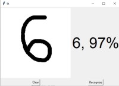

# Real Time Digit Recognition

Simple real time digit recognition application developed in python, where user draws a digit in the GUI and application predicts the drawn digit.

1. Training data and test data are loaded using mnist dataset provided by keras. Then the data is reshaped to the shape which is our model expects while training.
2. One-hot encoding is done on target variable, i.e. a column is created for each kind of output and provided with a binary value.
3. CNN sequential model is created  and compiled.
4. The model is trained on the training data and the trained weights is stored in a file named 'mnist.h5'.
5. An interactive window is created using python Tkinter library, to draw digits on canvas and buttons to predict output and clear screen.
6. When the predict button is pressed, handle related to canvas window is stored in HWND. Then the image of canvas screen is grabbed using PIL ImageGrab. This image is passed to `predict_digit()` function to predict digit.
7. Before prediction can be done, image is preprocessed using following steps.
    a. Convert the image to grayscale.
    b. Binarize the image such that only digit in image is white and rest is black.
    c. Find the contours in binarized image
    d. Create a bounding box around digit and crop the portion.
    e. Resize the cropped portion to 18x18, providing a padding of 5px all around, such that image size becomes 28x28.
8. Load the pretrained model weights and used it on processed image to predict the digit.